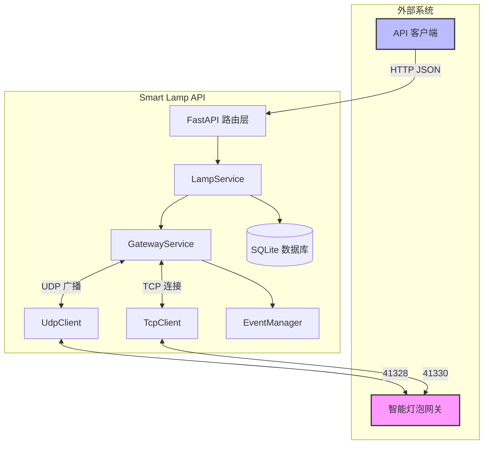
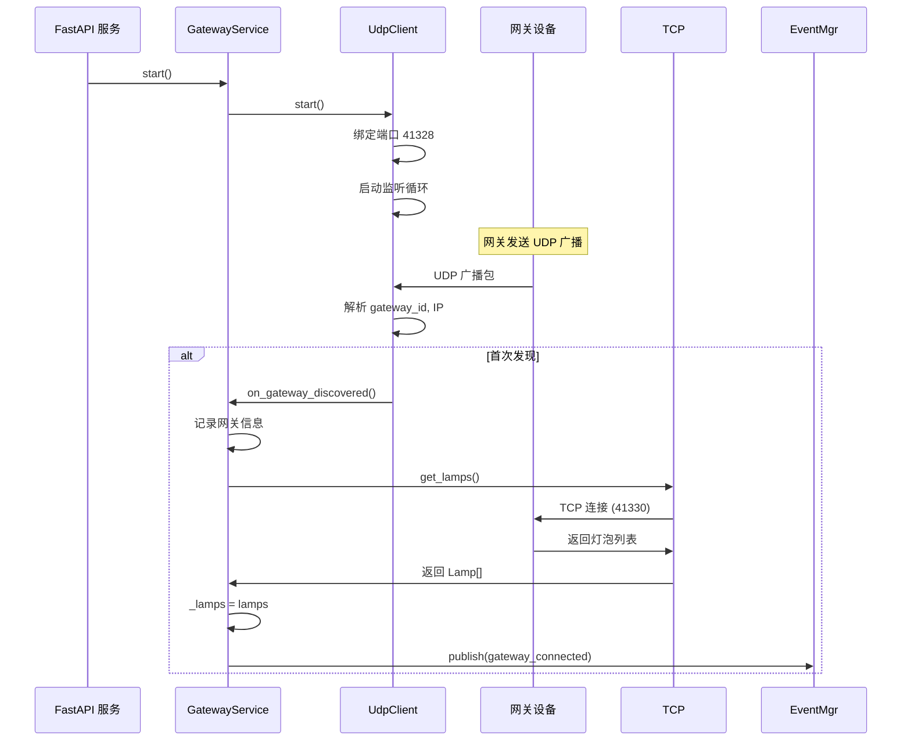
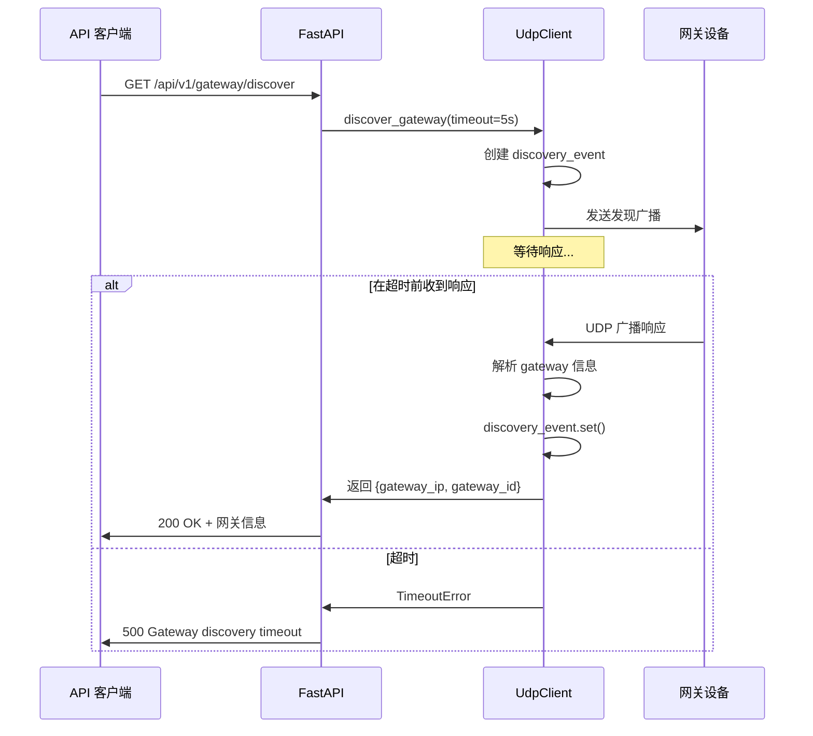
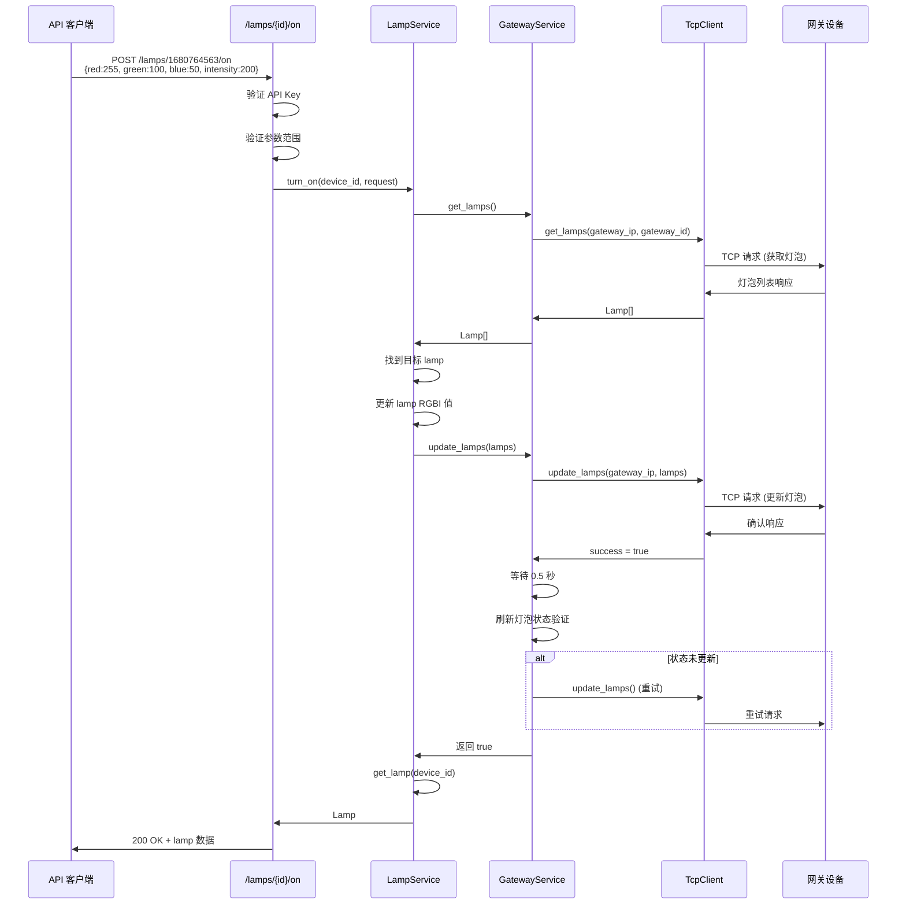
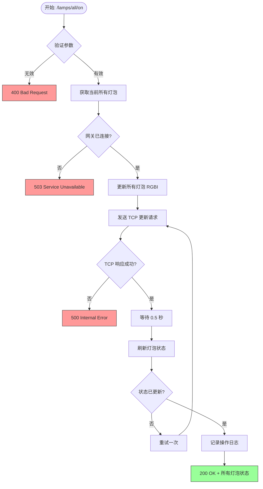
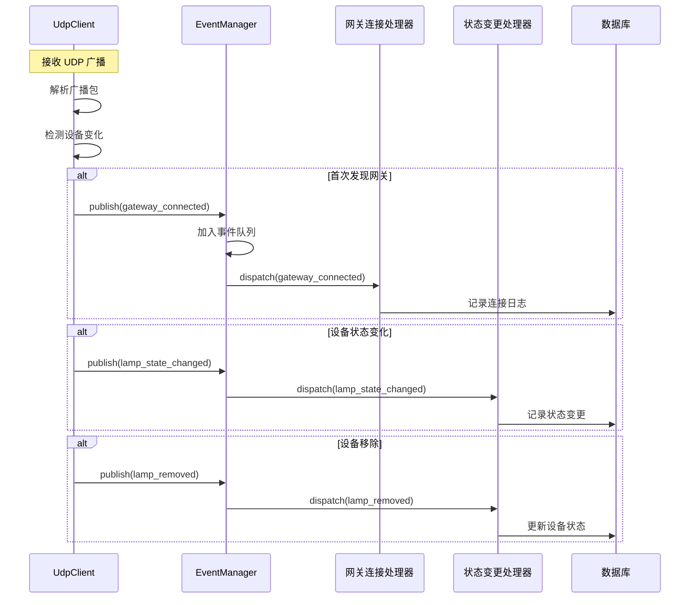
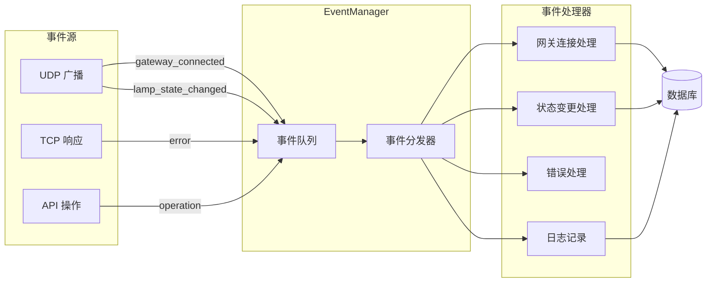
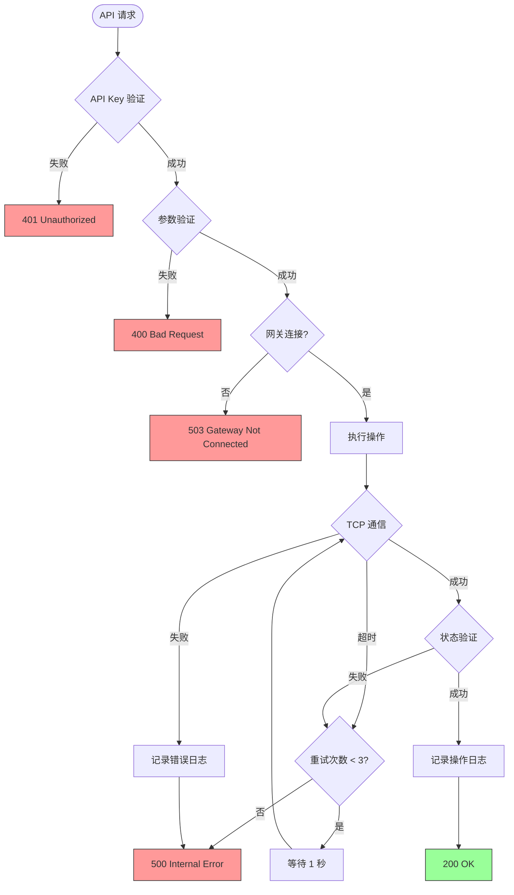
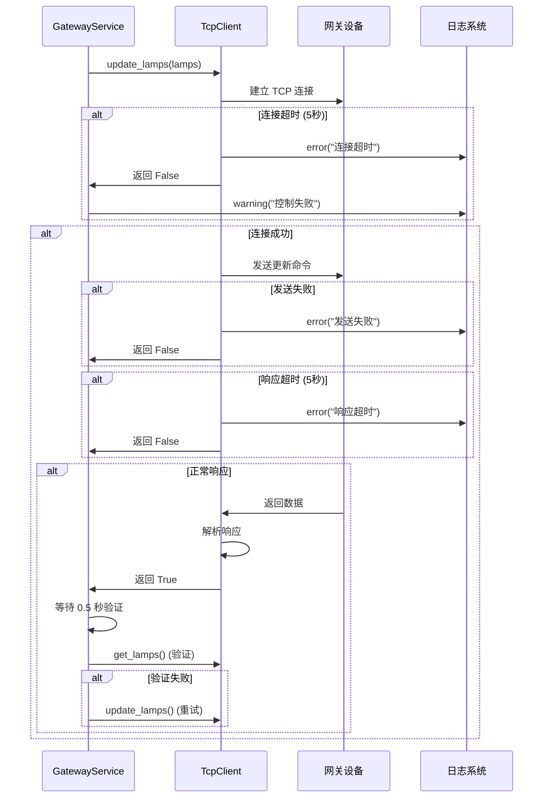
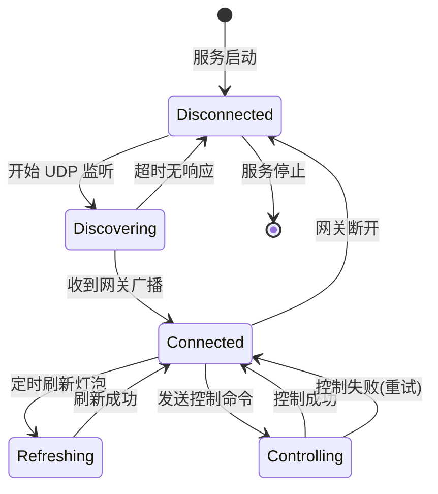

# Smart Lamp 业务流程图

> **版本**: 1.0
> **日期**: 2026-03-19
> **作者**: Business Analyst

---

## 目录

1. [系统架构](#1-系统架构)
2. [设备发现流程](#2-设备发现流程)
3. [灯泡控制流程](#3-灯泡控制流程)
4. [事件处理流程](#4-事件处理流程)
5. [错误处理流程](#5-错误处理流程)

---

## 1. 系统架构

---

## 2. 设备发现流程

### 2.1 启动时自动发现

### 2.2 主动发现

---

## 3. 灯泡控制流程

### 3.1 开启单个灯泡

### 3.2 批量控制流程

---

## 4. 事件处理流程

### 4.1 事件类型与处理

---

## 5. 错误处理流程

### 5.1 完整错误处理树

### 5.2 TCP 通信错误处理

### 5.3 错误码映射

| 错误场景 | HTTP 状态码 | 错误消息 | 日志级别 |
|----------|-------------|----------|----------|
| API Key 缺失/无效 | 401 | Unauthorized | WARNING |
| 参数验证失败 | 400 | Invalid parameter: {field} | INFO |
| 网关未连接 | 503 | Gateway not connected | WARNING |
| TCP 连接超时 | 500 | Failed to connect to gateway | ERROR |
| TCP 响应超时 | 500 | Gateway response timeout | ERROR |
| 控制失败 | 500 | Failed to control lamp {id} | ERROR |
| 设备不存在 | 404 | Lamp {id} not found | INFO |

---

## 附录

### A. 状态转换图

### B. 时序说明

| 操作 | 预计耗时 | 说明 |
|------|----------|------|
| UDP 网关发现 | < 30 秒 | 首次发现可能需要等待 |
| TCP 获取灯泡 | < 1 秒 | 正常网络条件下 |
| TCP 更新灯泡 | < 1 秒 | 单次请求 |
| 状态验证等待 | 0.5 秒 | 固定延迟 |
| 重试间隔 | 1 秒 | 可配置 |

### C. 相关文档

- [需求规格说明书](./requirements.md)
- [API 契约文档](./api-contract.md)
- [数据字典](./data-dictionary.md)
- [协议文档](./protocol.md)

---

*文档变更历史*

| 版本 | 日期 | 作者 | 变更说明 |
|------|------|------|----------|
| 1.0 | 2026-03-19 | BA | 初始版本 |
